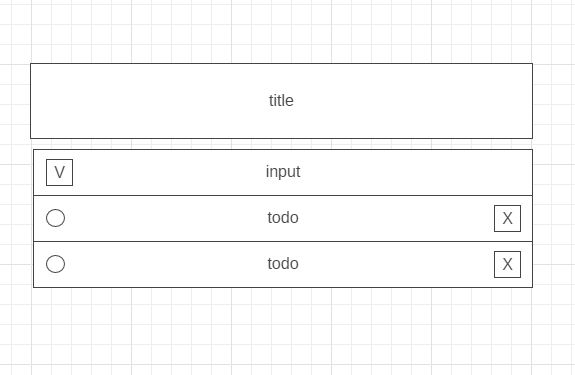

# Todo List

A simple app which user can write and store todos.

---

## User Story Dependencies

[Story Dependency Diagram](https://excalidraw.com/)

---

## WIREFRAME

---

## 0.Setup

---

## 1. User Story: Initialize Application

__As a user I want to see the initial page when I load the site__

- _Given I have the page open when I go to the page URL then I should see an initial page with a page title, and input field to add new todo_
- ...

### REPO

- This user story is developed on branch `1-initial-screen`.
- This branch is merged to `master` branch after completion.

### JS

#### DATA

#### HANDLER

- Define a `handlers` object to restore handler functions as methods.
- Define a `displayTodos` method which will take HTML rendered by `view.renderTodos()` method and append it to the DOM.

#### WIEW

- Define a view object to restore functions which will render HTML from data as object methods.
- Define a `renderTodos` method inside view object which will read from `state` object and render HTML for initial screen.

---

## 2. User Story: Add Todo

__As a user I want to be able to add new Todo__

- _Given I have initial page open I should be able to type into the input field and add a new todo to the list below input field by hitting enter_

### REPO

- This user story is developed on branch `2-add-todo`.
- This branch is merged to `master` branch after completion.

### JS

#### DATA

- Define a todo class to store information and methods if necessary for todos'.
- Define a state object to restore todos', other necessary data and methods if necessary.
- Define a todoList array inside the state object.
- Add a `addTodo` method to state object which will create a new to do from todo class and add it to the `todos` array inside the state object.

#### LISTENER

- Add a listener function to the `init.js` which listens input field for `submit` events and calls the handler `hamdlers.addTodo()` method.

#### HANDLER

- Add a `addTodo` method to the `handlers` object which reads user input from the input field and passes it into `state.addTodo()` method, the calls `handler.displayTodos()` method to render new to do to the page. 

## 3. User Story: Toggle Done

__As a user I want to be able to check and see which todos I have completed and uncheck if I want to__

- _Given I have the app open I should see a checkbox with each todo and to be able to check or uncheck todos by clicking the checkbox_

### REPO

- This user story is developed on branch `3-toggle-done`.
- This branch is merged to `master` branch after completion.

### VIEW

- Add an `<input>` with a type of checkbox to HTML template rendered by the `view.renderTodo` method.

## 4. User Story: Delete Todo

__As a user I would like to be able to delete todos__

- _Given I have the app open I should see a delete button beside every todo which deletes the corresponding todo upon click_

### REPO

- This user story is developed on branch `4-delete-todo`.
- This branch is merged to `master` branch after completion.

### JS

#### DATA

- Add a `deleteTodo` method to the state object which deletes the corresponding todo object from the todolist.

#### HANDLER

- Add a `deleteTodo` method to the `handlers` object which, after delete button is clicked, reads the index of the corresponding todo and passes it to `state.deleteTodo` method to remove from `state.todoList` and then calls the `handlers.displayTodos` method.

#### VIEW

- Add HTML template rendered by `view.renderTodo` method a delete button which has a `data-index` attribute matches with the index of the todo object inside `state.todoList` array.

#### LISTENER

- Add a listener function to the `init.js` file which listens whole todo list for the click events and if `event.target` is a delete button calls the `handlers.deleteTodo`. 

## 5. User Story: Toggle Done All

__As a user I would like to be able to check all todos as complete or incomplete at once__

- _Given I have the app open I should see a button which checks all todos as incomplete if all todos are checked complete otherwise it should check all todos complete.

### REPO

- This user story is developed on branch `5-toggle-all`.
- This branch is merged to `master` branch after completion.

### JS

#### DATA

- Add a `isComplete` property to todo class constructor which is `false` by default.

#### HANDLER

- Add a `toggleAll` method to `handlers` object which will loop trough the `state.todoList` checking if the `isComplete` property of each todo is `true` or `false` and if all of them are true it changes them all to `false` if not to `true`.

#### VIEW 

- Add a code snippet to the `view.renderTodo` method which checks the `isComplete` property of each todo and adds ot removes `checked` attribute to the checkbox input of corresponding todo depending of the value of `isComplete`

- Add a toggle all button to the HTML rendered by the `view.renderTodo` method.

#### LISTENER

- Add listener function to the `init.js` which listens for the click events on toggle all button and calls the `handlers.toggleAll` method.

## 6. User Story: Local Storage

__As a user I would like to see my todos and their status even if I refresh or close the page__

- _Given I have the page refreshed I should be able to see the todos I added and if they are completed or not__

### REPO

- This user story is developed on branch `6-local-storage`.
- This branch is merged to `master` branch after completion.

#### DATA

- Add a function to the `init.js` which checks local storage on every initiation for the final version of state object and updates it.

#### HANDLER

- Modify each handler to update local storage following each change on the state object.

## 7. User Story: Style

__As user I want to see well design page__

- _Given I have the app open I should be wowww!_

### REPO

- This user story is developed on branch `7-CSS`.
- This branch is merged to `master` branch after completion.

#### CSS

- Add CSS rules for layout.
- Add CSS rules for styling.

---